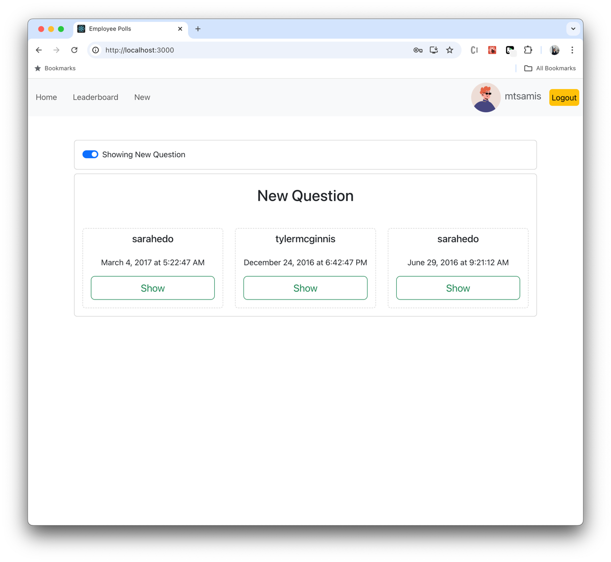
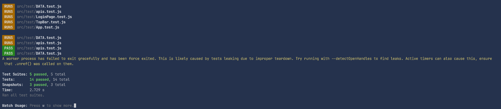

# Employee Polls
## Overview
A web app that lets an employee create polls for coworkers. The process goes like this: An employee is asked a question in the form: “Would you rather [option A] or [option B] ?”. Answering "neither" or "both" is not possible.\

## Available Scripts
In the project directory, you can run:
### `npm install`
This will install all required dependencies.
### `npm start`
Runs the app in the development mode.\
Open [http://localhost:3000](http://localhost:3000) to view it in your browser.\
The page will reload when you make changes.\
You may also see any lint errors in the console.
### `npm test`
Important: Please run all test at project root folder.
Below is test's result when running all test.

Launches the test runner in the interactive watch mode.\
See the section about [running tests](https://facebook.github.io/create-react-app/docs/running-tests) for more information.